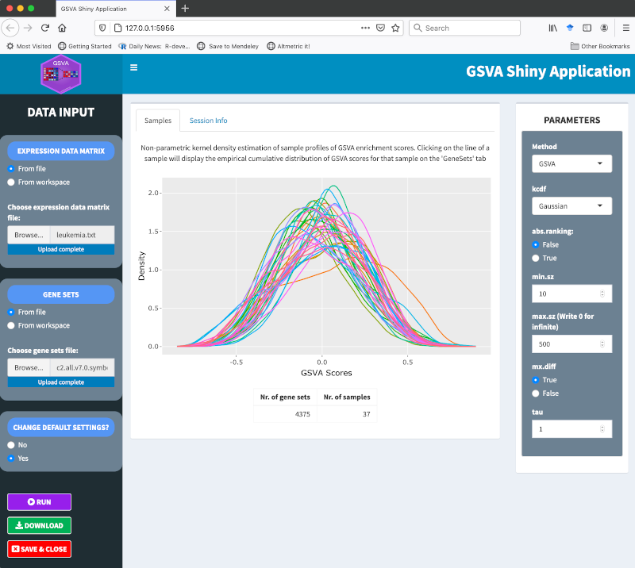
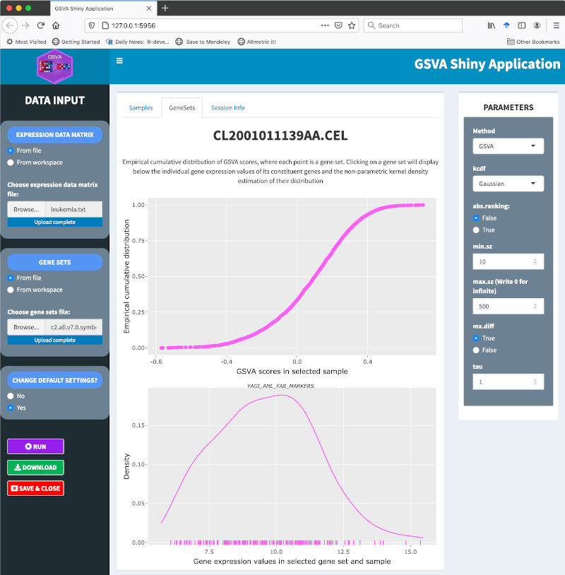

**License**: `r packageDescription("GSVA")[["License"]]`

```{r setup, include=FALSE}
options(width=80)
knitr::opts_chunk$set(collapse=TRUE,
                      message=FALSE,
                      comment="")
```

# Quick start

`r Biocpkg("GSVA")` is an R package distributed as part of the
[Bioconductor](https://bioconductor.org) project. To install the package, start
R and enter:

```{r library_install, message=FALSE, cache=FALSE, eval=FALSE}
install.packages("BiocManager")
BiocManager::install("GSVA")
```

Once `r Biocpkg("GSVA")` is installed, it can be loaded with the following command.

```{r load_library, message=FALSE, warning=FALSE, cache=FALSE}
library(GSVA)
```

Given a gene expression data matrix, which we shall call `X`, with rows
corresponding to genes and columns to samples, such as this one simulated from
random Gaussian data:

```{r}
p <- 10000 ## number of genes
n <- 30    ## number of samples
## simulate expression values from a standard Gaussian distribution
X <- matrix(rnorm(p*n), nrow=p,
            dimnames=list(paste0("g", 1:p), paste0("s", 1:n)))
X[1:5, 1:5]
```

Given a collection of gene sets stored, for instance, in a `list` object, which
we shall call `gs`, with genes sampled uniformly at random without replacement
into 100 different gene sets:

```{r}
## sample gene set sizes
gs <- as.list(sample(10:100, size=100, replace=TRUE))
## sample gene sets
gs <- lapply(gs, function(n, p)
                   paste0("g", sample(1:p, size=n, replace=FALSE)), p)
names(gs) <- paste0("gs", 1:length(gs))
```

We can calculate GSVA enrichment scores as follows. First we should build
a parameter object for the desired methodology. Here we illustrate it with
the GSVA algorithm of @haenzelmann_castelo_guinney_2013 by calling the
function `gsvaParam()`, but other parameter object constructor functions
are available; see in the next section below.

```{r}
gsvaPar <- gsvaParam(X, gs)
gsvaPar
```

The first argument to the `gsvaParam()` function constructing this parameter
object is the gene expression data matrix, and the second is the collection of
gene sets. In this example, we provide expression data and gene sets into
base R _matrix_ and _list_ objects, respectively, to the `gsvaParam()` function,
but it can take also different specialized containers that facilitate the access
and manipulation of molecular and phenotype data, as well as their associated
metadata.

Second, we call the `gsva()` function with the parameter object as first
argument. Other additional arguments to the `gsva()` function are `verbose` to
control progress reporting and `BPPPARAM` to perform calculations in parallel
through the package `r Biocpkg("BiocParallel")`.

```{r}
gsva.es <- gsva(gsvaPar, verbose=FALSE)
dim(gsva.es)
gsva.es[1:5, 1:5]
```

# Introduction

Gene set variation analysis (GSVA) provides an estimate of pathway activity
by transforming an input gene-by-sample expression data matrix into a
corresponding gene-set-by-sample expression data matrix. This resulting
expression data matrix can be then used with classical analytical methods such
as differential expression, classification, survival analysis, clustering or
correlation analysis in a pathway-centric manner. One can also perform
sample-wise comparisons between pathways and other molecular data types such
as microRNA expression or binding data, copy-number variation (CNV) data or
single nucleotide polymorphisms (SNPs).

The GSVA package provides an implementation of this approach for the following
methods:

* _plage_ [@tomfohr_pathway_2005]. Pathway level analysis of gene expression
  (PLAGE) standardizes expression profiles over the samples and then, for each
  gene set, it performs a singular value decomposition (SVD) over its genes.
  The coefficients of the first right-singular vector are returned as the
  estimates of pathway activity over the samples. Note that, because of how
  SVD is calculated, the sign of its singular vectors is arbitrary.

* _zscore_ [@lee_inferring_2008]. The z-score method standardizes expression
  profiles over the samples and then, for each gene set, combines the
  standardized values as follows. Given a gene set $\gamma=\{1,\dots,k\}$
  with standardized values $z_1,\dots,z_k$ for each gene in a specific sample,
  the combined z-score $Z_\gamma$ for the gene set $\gamma$ is defined as:
  $$
  Z_\gamma = \frac{\sum_{i=1}^k z_i}{\sqrt{k}}\,.
  $$

* _ssgsea_ [@barbie_systematic_2009]. Single sample GSEA (ssGSEA) is a
  non-parametric method that calculates a gene set enrichment score per sample
  as the normalized difference in empirical cumulative distribution functions
  (CDFs) of gene expression ranks inside and outside the gene set. By default,
  the implementation in the GSVA package follows the last step described in
  [@barbie_systematic_2009, online methods, pg. 2] by which pathway scores are
  normalized, dividing them by the range of calculated values. This normalization
  step may be switched off using the argument `ssgsea.norm` in the call to the
  `gsva()` function; see below.

* _gsva_ [@haenzelmann_castelo_guinney_2013]. This is the default method of
  the package and similarly to ssGSEA, is a non-parametric method that
  uses the empirical CDFs of gene expression ranks inside and outside the gene
  set, but it starts by calculating an expression-level statistic that brings
  gene expression profiles with different dynamic ranges to a common scale.

The interested user may find full technical details about how these methods
work in their corresponding articles cited above. If you use any of them in a
publication, please cite them with the given bibliographic reference.

# Overview of the GSVA functionality

The workhorse of the GSVA package is the function `gsva()`, which takes
a *parameter object* as its main input. There are four classes of parameter
objects corresponding to the methods listed above, and may have different
additional parameters to tune, but all of them require at least the following
two input arguments:

1. A normalized gene expression dataset, which can be provided in one of the
   following containers:
   * A `matrix` of expression values with genes corresponding to rows and samples
     corresponding to columns.
   * An `ExpressionSet` object; see package `r Biocpkg("Biobase")`.
   * A `SummarizedExperiment` object, see package
     `r Biocpkg("SummarizedExperiment")`.
2. A collection of gene sets; which can be provided in one of the following
   containers:
   * A `list` object where each element corresponds to a gene set defined by a
     vector of gene identifiers, and the element names correspond to the names of
     the gene sets.
   * A `GeneSetCollection` object; see package `r Biocpkg("GSEABase")`.

One advantage of providing the input data using specialized containers such as
`ExpressionSet`, `SummarizedExperiment` and `GeneSetCollection` is that the
`gsva()` function will automatically map the gene identifiers between the
expression data and the gene sets (internally calling the function
`mapIdentifiers()` from the package `r Biocpkg("GSEABase")`), when they come
from different standard nomenclatures, i.e., _Ensembl_ versus _Entrez_, provided
the input objects contain the appropriate metadata; see next section.

If either the input gene expression data is provided as a `matrix` object or
the gene sets are provided in a `list` object, or both, it is then the
responsibility of the user to ensure that both objects contain gene identifiers
following the same standard nomenclature.

Before the actual calculations take place, the `gsva()` function will apply
the following filters:

1. Discard genes in the input expression data matrix with constant expression.

2. Discard genes in the input gene sets that do not map to a gene in the input
   gene expression data matrix.

3. Discard gene sets that, after applying the previous filters, do not meet a
   minimum and maximum size, which by default is one for the minimum size and
   has no limit for the maximum size.

If, as a result of applying these three filters, either no genes or gene sets
are left, the `gsva()` function will prompt an error. A common cause for such
an error at this stage is that gene identifiers between the expression data
matrix and the gene sets do not belong to the same standard nomenclature and
could not be mapped. This may happen because either the input data were not
provided using some of the specialized containers described above or the
necessary metadata in those containers that allows the software to successfully
map gene identifiers, is missing.

The method employed by the `gsva()` function is determined by the class of the
parameter object that it receives as an input. An object constructed using the
`gsvaParam()` function runs the method described by
@haenzelmann_castelo_guinney_2013, but this can be changed using the parameter
constructor functions `plageParam()`, `zscoreParam()`, or `ssgseaParam()`,
corresponding to the methods briefly described in the introduction; see also
their corresponding help pages.

When using `gsvaParam()`, the user can additionally tune the following
parameters:

* `kcdf`: The first step of the GSVA algorithm brings gene expression
  profiles to a common scale by calculating an expression statistic through
  a non-parametric estimation of the CDF across samples. Such a non-parametric
  estimation employs a _kernel function_ and the `kcdf` parameter allows the
  user to specify three possible values for that function: (1) `"Gaussian"`,
  the default value, which is suitable for continuous expression data, such as
  microarray fluorescent units in logarithmic scale and RNA-seq log-CPMs,
  log-RPKMs or log-TPMs units of expression; (2) `"Poisson"`, which is
  suitable for integer counts, such as those derived from RNA-seq alignments; (3)
  `"none"`, which will enforce a direct estimation of the CDF without a kernel
  function.

* `maxDiff`: The last step of the GSVA algorithm calculates the gene set
  enrichment score from two Kolmogorov-Smirnov random walk statistics. This
  parameter is a logical flag that allows the user to specify two possible ways
  to do such calculation: (1) `TRUE`, the default value, where the enrichment
  score is calculated as the magnitude difference between the largest positive
  and negative random walk deviations; (2) `FALSE`, where the enrichment score
  is calculated as the maximum distance of the random walk from zero.

* `absRanking`: Logical flag used only when `maxDiff=TRUE`. By default,
  `absRanking=FALSE` and it implies that a modified Kuiper statistic is used
  to calculate enrichment scores, taking the magnitude difference between the
  largest positive and negative random walk deviations. When `absRanking=TRUE`
  the original Kuiper statistic is used, by which the largest positive and
  negative random walk deviations are added together. In this case, gene sets
  with genes enriched on either extreme (high or low) will be regarded as
  highly activated.

* `tau`: Exponent defining the weight of the tail in the random
  walk. By default `tau=1`.

In general, the default values for the previous parameters are suitable for
most analysis settings, which usually consist of some kind of normalized
continuous expression values.

# Gene set definitions

Gene sets constitute a simple, yet useful, way to define pathways because we
use pathway membership definitions only, neglecting the information on molecular
interactions. Gene set definitions are a crucial input to any gene set
enrichment analysis because if our gene sets do not capture the biological
processes we are studying, we will likely not find any relevant insights in our
data from an analysis based on these gene sets.

There are multiple sources of gene sets, the most popular ones being
[The Gene Ontology (GO) project](http://geneontology.org) and
[The Molecular Signatures Database (MSigDB)](https://www.gsea-msigdb.org/gsea/msigdb).
Sometimes gene set databases will not include the ones we need. In such a case
we should either curate our own gene sets or use techniques to infer them from
data.

The most basic data container for gene sets in R is the `list` class of objects,
as illustrated before in the quick start section, where we defined a toy collection
of three gene sets stored in a list object called `gs`:

```{r}
class(gs)
length(gs)
head(lapply(gs, head))
```

Using a Bioconductor organism-level package such as
`r Biocpkg("org.Hs.eg.db")` we can easily build a list object containing a
collection of gene sets defined as GO terms with annotated Entrez gene
identifiers, as follows:

```{r}
library(org.Hs.eg.db)

goannot <- select(org.Hs.eg.db, keys=keys(org.Hs.eg.db), columns="GO")
head(goannot)
genesbygo <- split(goannot$ENTREZID, goannot$GO)
length(genesbygo)
head(genesbygo)
```

A more sophisticated container for gene sets is the `GeneSetCollection`
object class defined in the `r Biocpkg("GSEABase")` package, which also
provides the function `getGmt()` to import
[gene matrix transposed (GMT)](http://software.broadinstitute.org/cancer/software/gsea/wiki/index.php/Data_formats#GMT:_Gene_Matrix_Transposed_file_format_.28.2A.gmt.29) files such as those
provided by [MSigDB](https://www.gsea-msigdb.org/gsea/msigdb) into a
`GeneSetCollection` object. The experiment data package
`r Biocpkg("GSVAdata")` provides one such object with the old (3.0) version
of the C2 collection of curated genesets from [MSigDB](https://www.gsea-msigdb.org/gsea/msigdb),
which can be loaded as follows.

```{r}
library(GSEABase)
library(GSVAdata)

data(c2BroadSets)
class(c2BroadSets)
c2BroadSets
```

The documentation of `r Biocpkg("GSEABase")` contains a description of the
`GeneSetCollection` class and its associated methods.

# Quantification of pathway activity in bulk microarray and RNA-seq data

Here we illustrate how GSVA provides an analogous quantification of pathway
activity in both microarray and RNA-seq data by using two such datasets that
have been derived from the same biological samples. More concretely, we will
use gene expression data of lymphoblastoid cell lines (LCL) from HapMap
individuals that have been profiled using both technologies
[@huang_genome-wide_2007, @pickrell_understanding_2010]. These data form part
of the experimental package `r Biocpkg("GSVAdata")` and the corresponding help
pages contain details on how the data were processed. We start loading these
data and verifying that they indeed contain expression data for the same genes
and samples, as follows:

```{r}
library(Biobase)

data(commonPickrellHuang)

stopifnot(identical(featureNames(huangArrayRMAnoBatchCommon_eset),
                    featureNames(pickrellCountsArgonneCQNcommon_eset)))
stopifnot(identical(sampleNames(huangArrayRMAnoBatchCommon_eset),
                    sampleNames(pickrellCountsArgonneCQNcommon_eset)))
```
Next, for the current analysis we use the subset of canonical pathways from the C2
collection of MSigDB Gene Sets. These correspond to the following pathways from
KEGG, REACTOME and BIOCARTA:

```{r}
canonicalC2BroadSets <- c2BroadSets[c(grep("^KEGG", names(c2BroadSets)),
                                      grep("^REACTOME", names(c2BroadSets)),
                                      grep("^BIOCARTA", names(c2BroadSets)))]
canonicalC2BroadSets
```
Additionally, we extend this collection of gene sets with two formed by genes
with sex-specific expression, which also form part of the `r Biocpkg("GSVAdata")`
experiment data package. Here we use the constructor function `GeneSet` from the
`r Biocpkg("GSEABase")` package to build the objects that we add to the
`GeneSetCollection` object `canonicalC2BroadSets`.

```{r}
data(genderGenesEntrez)

MSY <- GeneSet(msYgenesEntrez, geneIdType=EntrezIdentifier(),
               collectionType=BroadCollection(category="c2"),
               setName="MSY")
MSY
XiE <- GeneSet(XiEgenesEntrez, geneIdType=EntrezIdentifier(),
               collectionType=BroadCollection(category="c2"),
               setName="XiE")
XiE

canonicalC2BroadSets <- GeneSetCollection(c(canonicalC2BroadSets, MSY, XiE))
canonicalC2BroadSets
```
We calculate now GSVA enrichment scores for these gene sets using first the
normalized microarray data and then the normalized RNA-seq integer count data.
Note that the only requirement to do the latter is to set the argument
`kcdf="Poisson"`, which is `"Gaussian"` by default. Note, however, that if our
RNA-seq normalized expression levels would be continuous, such as log-CPMs,
log-RPKMs or log-TPMs, the default value of the `kcdf` argument should remain
unchanged.

```{r, results="hide"}
huangPar <- gsvaParam(huangArrayRMAnoBatchCommon_eset, canonicalC2BroadSets,
                      minSize=5, maxSize=500)
esmicro <- gsva(huangPar)
pickrellPar <- gsvaParam(pickrellCountsArgonneCQNcommon_eset,
                         canonicalC2BroadSets, minSize=5, maxSize=500,
                         kcdf="Poisson")
esrnaseq <- gsva(pickrellPar)
```
We are going to assess how gene expression profiles correlate between microarray
and RNA-seq data and compare those correlations with the ones derived at pathway
level. To compare gene expression values of both technologies, we will transform
first the RNA-seq integer counts into log-CPM units of expression using the
`cpm()` function from the `r Biocpkg("edgeR")` package.

```{r}
library(edgeR)

lcpms <- cpm(exprs(pickrellCountsArgonneCQNcommon_eset), log=TRUE)
```
We calculate Spearman correlations between gene expression profiles of the
previous log-CPM values and the microarray RMA values.

```{r}
genecorrs <- sapply(1:nrow(lcpms),
                    function(i, expmicro, exprnaseq)
                      cor(expmicro[i, ], exprnaseq[i, ], method="spearman"),
                    exprs(huangArrayRMAnoBatchCommon_eset), lcpms)
names(genecorrs) <- rownames(lcpms)
```
Now calculate Spearman correlations between GSVA enrichment scores derived
from the microarray and the RNA-seq data.

```{r}
pwycorrs <- sapply(1:nrow(esmicro),
                   function(i, esmicro, esrnaseq)
                     cor(esmicro[i, ], esrnaseq[i, ], method="spearman"),
                   exprs(esmicro), exprs(esrnaseq))
names(pwycorrs) <- rownames(esmicro)
```
Figure \@ref(fig:compcorrs) below shows the two distributions of these
correlations and we can see that GSVA enrichment scores provide an agreement
between microarray and RNA-seq data comparable to the one observed between
gene-level units of expression.

```{r compcorrs, height=500, width=1000, fig.cap="Comparison of correlation values of gene and pathway expression profiles derived from microarray and RNA-seq data."}
par(mfrow=c(1, 2), mar=c(4, 5, 3, 2))
hist(genecorrs, xlab="Spearman correlation",
     main="Gene level\n(RNA-seq log-CPMs vs microarray RMA)",
     xlim=c(-1, 1), col="grey", las=1)
hist(pwycorrs, xlab="Spearman correlation",
     main="Pathway level\n(GSVA enrichment scores)",
     xlim=c(-1, 1), col="grey", las=1)
```

Finally, in Figure \@ref(fig:compsexgenesets) we compare the actual GSVA
enrichment scores for two gene sets formed by genes with sex-specific expression.
Concretely, one gene set (XIE) formed by genes that escape chromosome
X-inactivation in females [@carrel_x-inactivation_2005] and another gene set
(MSY) formed by genes located on the male-specific region of chromosome Y
[@skaletsky_male-specific_2003].

```{r compsexgenesets, height=500, width=1000, fig.cap="Comparison of GSVA enrichment scores obtained from microarray and RNA-seq data for two gene sets formed by genes with sex-specific expression."}
par(mfrow=c(1, 2))
rmsy <- cor(exprs(esrnaseq)["MSY", ], exprs(esmicro)["MSY", ])
plot(exprs(esrnaseq)["MSY", ], exprs(esmicro)["MSY", ],
     xlab="GSVA scores RNA-seq", ylab="GSVA scores microarray",
     main=sprintf("MSY R=%.2f", rmsy), las=1, type="n")
fit <- lm(exprs(esmicro)["MSY", ] ~ exprs(esrnaseq)["MSY", ])
abline(fit, lwd=2, lty=2, col="grey")
maskPickrellFemale <- pickrellCountsArgonneCQNcommon_eset$Gender == "Female"
maskHuangFemale <- huangArrayRMAnoBatchCommon_eset$Gender == "Female"
points(exprs(esrnaseq["MSY", maskPickrellFemale]),
       exprs(esmicro)["MSY", maskHuangFemale],
       col="red", pch=21, bg="red", cex=1)
maskPickrellMale <- pickrellCountsArgonneCQNcommon_eset$Gender == "Male"
maskHuangMale <- huangArrayRMAnoBatchCommon_eset$Gender == "Male"
points(exprs(esrnaseq)["MSY", maskPickrellMale],
       exprs(esmicro)["MSY", maskHuangMale],
       col="blue", pch=21, bg="blue", cex=1)
legend("topleft", c("female", "male"), pch=21, col=c("red", "blue"),
       pt.bg=c("red", "blue"), inset=0.01)
rxie <- cor(exprs(esrnaseq)["XiE", ], exprs(esmicro)["XiE", ])
plot(exprs(esrnaseq)["XiE", ], exprs(esmicro)["XiE", ],
     xlab="GSVA scores RNA-seq", ylab="GSVA scores microarray",
     main=sprintf("XiE R=%.2f", rxie), las=1, type="n")
fit <- lm(exprs(esmicro)["XiE", ] ~ exprs(esrnaseq)["XiE", ])
abline(fit, lwd=2, lty=2, col="grey")
points(exprs(esrnaseq["XiE", maskPickrellFemale]),
       exprs(esmicro)["XiE", maskHuangFemale],
       col="red", pch=21, bg="red", cex=1)
points(exprs(esrnaseq)["XiE", maskPickrellMale],
       exprs(esmicro)["XiE", maskHuangMale],
       col="blue", pch=21, bg="blue", cex=1)
legend("topleft", c("female", "male"), pch=21, col=c("red", "blue"),
       pt.bg=c("red", "blue"), inset=0.01)
```
We can see how microarray and RNA-seq single-sample GSVA enrichment scores
correlate very well in these gene sets, with $\rho=0.80$ for the male-specific
gene set and $\rho=0.79$ for the female-specific gene set. Male and female
samples show higher GSVA enrichment scores in their corresponding gene set.

# Example applications

## Molecular signature identification

In [@verhaak_integrated_2010] four subtypes of glioblastoma multiforme (GBM)
-proneural, classical, neural and mesenchymal- were identified by the
characterization of distinct gene-level expression patterns. Using four
gene set signatures specific to brain cell types (astrocytes, oligodendrocytes,
neurons and cultured astroglial cells), derived from murine models by
@cahoy_transcriptome_2008, we replicate the analysis of @verhaak_integrated_2010
by using GSVA to transform the gene expression measurements into enrichment
scores for these four gene sets, without taking the sample subtype grouping
into account. We start by having a quick glance to the data, which forms part of
the `r Biocpkg("GSVAdata")` package:

```{r}
data(gbm_VerhaakEtAl)
gbm_eset
head(featureNames(gbm_eset))
table(gbm_eset$subtype)
data(brainTxDbSets)
lengths(brainTxDbSets)
lapply(brainTxDbSets, head)
```

GSVA enrichment scores for the gene sets contained in `brainTxDbSets`
are calculated, in this case using `mx.diff=FALSE`,  as follows:

```{r, results="hide"}
gbmPar <- gsvaParam(gbm_eset, brainTxDbSets, maxDiff=FALSE)
gbm_es <- gsva(gbmPar)
```

Figure \@ref(fig:gbmSignature) shows the GSVA enrichment scores obtained for the
up-regulated gene sets across the samples of the four GBM subtypes. As expected,
the _neural_ class is associated with the neural gene set and the astrocytic
gene sets. The _mesenchymal_ subtype is characterized by the expression of
mesenchymal and microglial markers, thus we expect it to correlate with the
astroglial gene set. The _proneural_ subtype shows high expression of
oligodendrocytic development genes, thus it is not surprising that the
oligodendrocytic gene set is highly enriched for ths group. Interestingly, the
_classical_ group correlates highly with the astrocytic gene set. In
summary, the resulting GSVA enrichment scores recapitulate accurately the
molecular signatures from @verhaak_integrated_2010.

```{r gbmSignature, height=500, width=700, fig.cap="Heatmap of GSVA scores for cell-type brain signatures from murine models (y-axis) across GBM samples grouped by GBM subtype."}
library(RColorBrewer)
subtypeOrder <- c("Proneural", "Neural", "Classical", "Mesenchymal")
sampleOrderBySubtype <- sort(match(gbm_es$subtype, subtypeOrder),
                             index.return=TRUE)$ix
subtypeXtable <- table(gbm_es$subtype)
subtypeColorLegend <- c(Proneural="red", Neural="green",
                        Classical="blue", Mesenchymal="orange")
geneSetOrder <- c("astroglia_up", "astrocytic_up", "neuronal_up",
                  "oligodendrocytic_up")
geneSetLabels <- gsub("_", " ", geneSetOrder)
hmcol <- colorRampPalette(brewer.pal(10, "RdBu"))(256)
hmcol <- hmcol[length(hmcol):1]

heatmap(exprs(gbm_es)[geneSetOrder, sampleOrderBySubtype], Rowv=NA,
        Colv=NA, scale="row", margins=c(3,5), col=hmcol,
        ColSideColors=rep(subtypeColorLegend[subtypeOrder],
                          times=subtypeXtable[subtypeOrder]),
        labCol="", gbm_es$subtype[sampleOrderBySubtype],
        labRow=paste(toupper(substring(geneSetLabels, 1,1)),
                     substring(geneSetLabels, 2), sep=""),
        cexRow=2, main=" \n ")
par(xpd=TRUE)
text(0.23,1.21, "Proneural", col="red", cex=1.2)
text(0.36,1.21, "Neural", col="green", cex=1.2)
text(0.47,1.21, "Classical", col="blue", cex=1.2)
text(0.62,1.21, "Mesenchymal", col="orange", cex=1.2)
mtext("Gene sets", side=4, line=0, cex=1.5)
mtext("Samples          ", side=1, line=4, cex=1.5)
```

## Differential expression at pathway level

We illustrate here how to conduct a differential expression analysis at
pathway level. We will use an example gene expression microarray data from
@armstrong_mll_2002, which consists of 37 different individuals with human
acute leukemia, where 20 of them have conventional childhood acute
lymphoblastic leukemia (ALL) and the other 17 are affected with the MLL
(mixed-lineage leukemia gene) translocation. This leukemia data set is stored as
an `ExpressionSet` object called `leukemia` in the `r Biocpkg("GSVAdata")`
package and and details on how the data was pre-processed can be found in the
corresponding help page. Jointly with the RMA expression values, we
provide some metadata including the main phenotype corresponding to the leukemia
sample subtype.

```{r}
data(leukemia)
leukemia_eset
```

Next, we calculate GSVA enrichment scores using a subset of gene sets from the
MSigDB C2 collection that represent signatures of genetic and chemical
perturbations (CGP), and setting the the minimum and maximum gene set size to
10 and 500 genes, respectively.

```{r, results="hide"}
cgpC2BroadSets <- c2BroadSets[c(grep("_UP$", names(c2BroadSets)),
                                grep("_DN$", names(c2BroadSets)))]
cgpC2BroadSets
leukPar <- gsvaParam(leukemia_eset, cgpC2BroadSets,
                     minSize=10, maxSize=500)
leukemia_es <- gsva(leukPar)
```
The object returned by the function `gsva()` is always of the same class
as the input object with the expression data. Therefore, in this case,
we obtain an `ExpressionSet` object with features corresponding to gene
sets.

```{r}
class(leukemia_es)
leukemia_es
head(featureNames(leukemia_es))
```
We will perform now a differential expression analysis using `r Biocpkg("limma")`
[@Smyth_2004] between the two different leukemia subtypes.

```{r}
library(limma)

mod <- model.matrix(~ factor(leukemia_es$subtype))
colnames(mod) <- c("ALL", "MLLvsALL")
fit <- lmFit(leukemia_es, mod)
fit <- eBayes(fit)
res <- decideTests(fit, p.value=0.01)
summary(res)
```

As Figure \@ref(fig:setsizebysigma) below shows, GSVA scores have higher
precision for larger gene sets^[Thanks to Gordon Smyth for point this out to us.].

```{r setsizebysigma, height=700, width=500, fig.cap="Residual standard deviation of GSVA scores as function of gene set size."}
gssizes <- lengths(geneIds(cgpC2BroadSets)) ## fetch gene set sizes
mt <- match(rownames(leukemia_es), names(gssizes))
gssizes <- gssizes[mt] ## rearrange gene set sizes to the rows of GSVA scores
plot(sqrt(gssizes), sqrt(fit$sigma), xlab="Sqrt(gene sets sizes)",
     ylab="Sqrt(standard deviation)", las=1, pch=".", cex=3)
```

In such a setting, we can improve the analysis of differentially expressed
pathways by using the limma-trend approach [@phipson2016robust] setting the
`trend` parameter in the call to the `eBayes()` function to the vector of gene
set sizes, in one-to-one correspondence with the gene sets in the rows of the
GSVA scores container, as calculated before in `gssizes`.

```{r}
fit <- eBayes(fit, trend=gssizes)
res <- decideTests(fit, p.value=0.01)
summary(res)
```

There are `r sum(res[, 2] != 0)` MSigDB C2 differentially expressed pathways
with FDR < 5%. Figure \@ref(fig:leukemiavolcano) below shows a volcano plot
of the expression changes.

```{r leukemiavolcano, height=700, width=500, fig.cap="Volcano plot for the differential expression analysis at pathway level between two leukemia subtypes."}
tt <- topTable(fit, coef=2, n=Inf)
DEpwys <- rownames(tt)[tt$adj.P.Val <= 0.01]
plot(tt$logFC, -log10(tt$P.Value), pch=".", cex=4, col=grey(0.75),
     main="", xlab="GSVA enrichment score difference", las=1,
     ylab=expression(-log[10]~~Raw~P-value))
abline(h=-log10(max(tt$P.Value[tt$adj.P.Val <= 0.01])),
       col=grey(0.5), lwd=1, lty=2)
points(tt$logFC[match(DEpwys, rownames(tt))],
       -log10(tt$P.Value[match(DEpwys, rownames(tt))]),
       pch=".", cex=5, col="darkred")
text(max(tt$logFC)*0.85, -log10(max(tt$P.Value[tt$adj.P.Val <= 0.01])),
     "1% FDR", pos=3)
```

Figure \@ref(fig:leukemiaheatmap) below shows a heatmap of GSVA enrichment
scores for the `r sum(res[, 2] != 0)` differentially expressed pathways.

```{r leukemiaheatmap, height=500, width=1200, fig.cap="Heatmap of GSVA enrichment scores for the differentially expressed pathways between two leukemia subtypes."}
DEpwys_es <- exprs(leukemia_es[DEpwys, ])
colorLegend <- c("darkred", "darkblue")
names(colorLegend) <- c("ALL", "MLL")
sample.color.map <- colorLegend[pData(leukemia_es)[, "subtype"]]
names(sample.color.map) <- colnames(DEpwys_es)
sampleClustering <- hclust(as.dist(1-cor(DEpwys_es, method="spearman")),
                           method="complete")
geneSetClustering <- hclust(as.dist(1-cor(t(DEpwys_es), method="pearson")),
                            method="complete")
heatmap(DEpwys_es, ColSideColors=sample.color.map, xlab="samples",
        ylab="Pathways", margins=c(2, 20),
        labRow=substr(gsub("_", " ", gsub("^KEGG_|^REACTOME_|^BIOCARTA_", "",
                                          rownames(DEpwys_es))), 1, 35),
        labCol="", scale="row", Colv=as.dendrogram(sampleClustering),
        Rowv=as.dendrogram(geneSetClustering))
legend("topleft", names(colorLegend), fill=colorLegend, inset=0.01, bg="white")
```

# Interactive web app

The `gsva()` function can be also used through an interactive web app developed
with `r CRANpkg("shiny")`. To start it just type on the R console:

```{r, eval=FALSE}
res <- igsva()
```

It will open your browser with the web app shown here below. The button
`SAVE & CLOSE` will close the app and return the resulting object on the
R console. Hence, the need to call igsva() on the right-hand side of an
assignment if you want to store the result in your workspace. Alternatively,
you can use the `DOWNLOAD` button to download the result in a CSV file.



In the starting window of the web app, after running GSVA, a non-parametric
kernel density estimation of sample profiles of GSVA scores will be shown.
By clicking on one of the lines, the cumulative distribution of GSVA scores
for the corresponding samples will be shown in the `GeneSets` tab, as
illustrated in the image below.



# Contributing

GSVA has benefited from contributions by multiple developers, see
[https://github.com/rcastelo/GSVA/graphs/contributors](https://github.com/rcastelo/GSVA/graphs/contributors)
for a list of them. Contributions to the software codebase of GSVA are welcome
as long as contributors abide to the terms of the
[Bioconductor Contributor Code of Conduct](https://bioconductor.org/about/code-of-conduct).
If you want to contribute to the development of GSVA please open an
[issue](https://github.com/rcastelo/GSVA/issues) to start discussing your
suggestion or, in case of a bugfix or a straightforward feature, directly a
[pull request](https://github.com/rcastelo/GSVA/pulls).

# Session information {.unnumbered}

Here is the output of `sessionInfo()` on the system on which this document was
compiled running pandoc `r rmarkdown::pandoc_version()`:

```{r session_info, cache=FALSE}
sessionInfo()
```

# References
