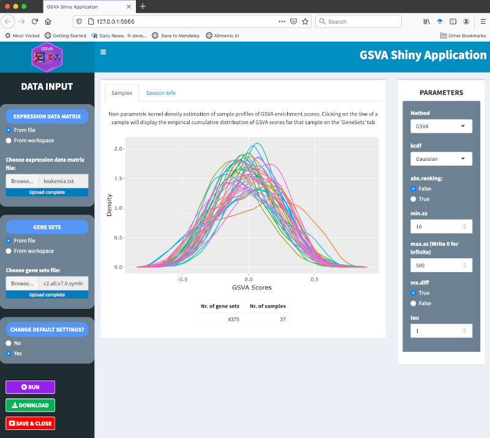
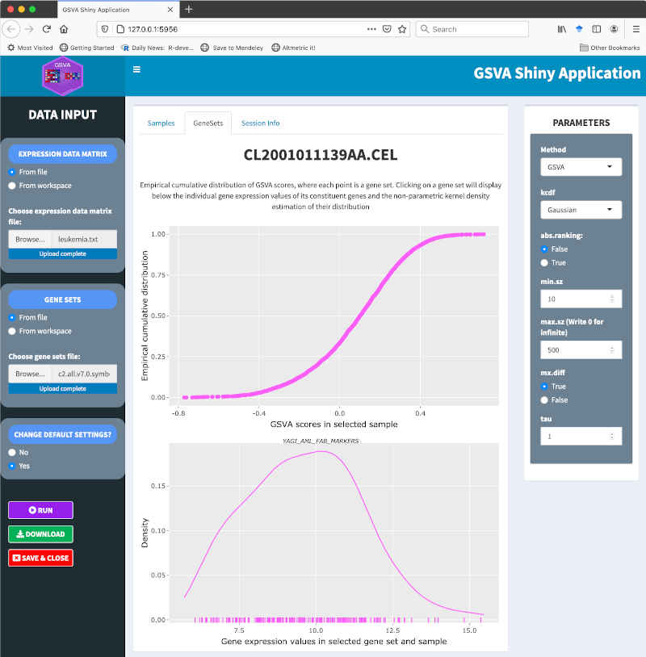

**License**: `r packageDescription("GSVA")[["License"]]`

```{r setup, include=FALSE}
options(width=80)
knitr::opts_chunk$set(collapse=TRUE,
                      message=FALSE,
                      comment="")
```

# Quick start

`r Biocpkg("GSVA")` is an R package distributed as part of the
[Bioconductor](https://bioconductor.org) project. To install the package, start
R and enter:

```{r library_install, message=FALSE, cache=FALSE, eval=FALSE}
install.packages("BiocManager")
BiocManager::install("GSVA")
```

Once `r Biocpkg("GSVA")` is installed, it can be loaded with the following command.

```{r load_library, message=FALSE, warning=FALSE, cache=FALSE}
library(GSVA)
```

Given a gene expression data matrix, which we shall call `X`, with rows
corresponding to genes and columns to samples, such as this one simulated from
random Gaussian data:

```{r}
p <- 10000 ## number of genes
n <- 30    ## number of samples
## simulate expression values from a standard Gaussian distribution
X <- matrix(rnorm(p*n), nrow=p,
            dimnames=list(paste0("g", 1:p), paste0("s", 1:n)))
X[1:5, 1:5]
```

Given a collection of gene sets stored, for instance, in a `list` object, which
we shall call `gs`, with genes sampled uniformly at random without replacement
into 100 different gene sets:

```{r}
## sample gene set sizes
gs <- as.list(sample(10:100, size=100, replace=TRUE))
## sample gene sets
gs <- lapply(gs, function(n, p)
                   paste0("g", sample(1:p, size=n, replace=FALSE)), p)
names(gs) <- paste0("gs", 1:length(gs))
```

We can calculate GSVA enrichment scores as follows. First we should build
a parameter object for the desired methodology. Here we illustrate it with
the GSVA algorithm of @haenzelmann_castelo_guinney_2013 by calling the
function `gsvaParam()`, but other parameter object constructor functions
are available; see in the next section below.

```{r}
gsvaPar <- gsvaParam(X, gs)
gsvaPar
```

The first argument to the `gsvaParam()` function constructing this parameter
object is the gene expression data matrix, and the second is the collection of
gene sets. In this example, we provide expression data and gene sets into
base R _matrix_ and _list_ objects, respectively, to the `gsvaParam()` function,
but it can take also different specialized containers that facilitate the access
and manipulation of molecular and phenotype data, as well as their associated
metadata.

Second, we call the `gsva()` function with the parameter object as first
argument. Other additional arguments to the `gsva()` function are `verbose` to
control progress reporting and `BPPPARAM` to perform calculations in parallel
through the package `r Biocpkg("BiocParallel")`.

```{r}
gsva.es <- gsva(gsvaPar, verbose=FALSE)
dim(gsva.es)
gsva.es[1:5, 1:5]
```

# Introduction

Gene set variation analysis (GSVA) provides an estimate of pathway activity
by transforming an input gene-by-sample expression data matrix into a
corresponding gene-set-by-sample expression data matrix. This resulting
expression data matrix can be then used with classical analytical methods such
as differential expression, classification, survival analysis, clustering or
correlation analysis in a pathway-centric manner. One can also perform
sample-wise comparisons between pathways and other molecular data types such
as microRNA expression or binding data, copy-number variation (CNV) data or
single nucleotide polymorphisms (SNPs).

The GSVA package provides an implementation of this approach for the following
methods:

* _plage_ [@tomfohr_pathway_2005]. Pathway level analysis of gene expression
  (PLAGE) standardizes expression profiles over the samples and then, for each
  gene set, it performs a singular value decomposition (SVD) over its genes.
  The coefficients of the first right-singular vector are returned as the
  estimates of pathway activity over the samples. Note that, because of how
  SVD is calculated, the sign of its singular vectors is arbitrary.

* _zscore_ [@lee_inferring_2008]. The z-score method standardizes expression
  profiles over the samples and then, for each gene set, combines the
  standardized values as follows. Given a gene set $\gamma=\{1,\dots,k\}$
  with standardized values $z_1,\dots,z_k$ for each gene in a specific sample,
  the combined z-score $Z_\gamma$ for the gene set $\gamma$ is defined as:
  $$
  Z_\gamma = \frac{\sum_{i=1}^k z_i}{\sqrt{k}}\,.
  $$

* _ssgsea_ [@barbie_systematic_2009]. Single sample GSEA (ssGSEA) is a
  non-parametric method that calculates a gene set enrichment score per sample
  as the normalized difference in empirical cumulative distribution functions
  (CDFs) of gene expression ranks inside and outside the gene set. By default,
  the implementation in the GSVA package follows the last step described in
  [@barbie_systematic_2009, online methods, pg. 2] by which pathway scores are
  normalized, dividing them by the range of calculated values. This normalization
  step may be switched off using the argument `ssgsea.norm` in the call to the
  `gsva()` function; see below.

* _gsva_ [@haenzelmann_castelo_guinney_2013]. This is the default method of
  the package and similarly to ssGSEA, is a non-parametric method that
  uses the empirical CDFs of gene expression ranks inside and outside the gene
  set, but it starts by calculating an expression-level statistic that brings
  gene expression profiles with different dynamic ranges to a common scale.

The interested user may find full technical details about how these methods
work in their corresponding articles cited above. If you use any of them in a
publication, please cite them with the given bibliographic reference.

# Overview of the GSVA functionality

The workhorse of the GSVA package is the function `gsva()`, which takes
a *parameter object* as its main input. There are four classes of parameter
objects corresponding to the methods listed above, and may have different
additional parameters to tune, but all of them require at least the following
two input arguments:

1. A normalized gene expression dataset, which can be provided in one of the
   following containers:
   * A `matrix` of expression values with genes corresponding to rows and samples
     corresponding to columns.
   * An `ExpressionSet` object; see package `r Biocpkg("Biobase")`.
   * A `SummarizedExperiment` object, see package
     `r Biocpkg("SummarizedExperiment")`.
2. A collection of gene sets; which can be provided in one of the following
   containers:
   * A `list` object where each element corresponds to a gene set defined by a
     vector of gene identifiers, and the element names correspond to the names of
     the gene sets.
   * A `GeneSetCollection` object; see package `r Biocpkg("GSEABase")`.

One advantage of providing the input data using specialized containers such as
`ExpressionSet`, `SummarizedExperiment` and `GeneSetCollection` is that the
`gsva()` function will automatically map the gene identifiers between the
expression data and the gene sets (internally calling the function
`mapIdentifiers()` from the package `r Biocpkg("GSEABase")`), when they come
from different standard nomenclatures, i.e., _Ensembl_ versus _Entrez_, provided
the input objects contain the appropriate metadata; see next section.

If either the input gene expression data is provided as a `matrix` object or
the gene sets are provided in a `list` object, or both, it is then the
responsibility of the user to ensure that both objects contain gene identifiers
following the same standard nomenclature.

Before the actual calculations take place, the `gsva()` function will apply
the following filters:

1. Discard genes in the input expression data matrix with constant expression.

2. Discard genes in the input gene sets that do not map to a gene in the input
   gene expression data matrix.

3. Discard gene sets that, after applying the previous filters, do not meet a
   minimum and maximum size, which by default is one for the minimum size and
   has no limit for the maximum size.

If, as a result of applying these three filters, either no genes or gene sets
are left, the `gsva()` function will prompt an error. A common cause for such
an error at this stage is that gene identifiers between the expression data
matrix and the gene sets do not belong to the same standard nomenclature and
could not be mapped. This may happen because either the input data were not
provided using some of the specialized containers described above or the
necessary metadata in those containers that allows the software to successfully
map gene identifiers, is missing.

The method employed by the `gsva()` function is determined by the class of the
parameter object that it receives as an input. An object constructed using the
`gsvaParam()` function runs the method described by
@haenzelmann_castelo_guinney_2013, but this can be changed using the parameter
constructor functions `plageParam()`, `zscoreParam()`, or `ssgseaParam()`,
corresponding to the methods briefly described in the introduction; see also
their corresponding help pages.

When using `gsvaParam()`, the user can additionally tune the following
parameters, whose default values cover most of the use cases:

* `kcdf`: The first step of the GSVA algorithm brings gene expression
  profiles to a common scale by calculating an expression statistic through
  the estimation of the CDF across samples. The way in which such an estimation
  is performed by GSVA is controlled by the `kcdf` parameter, which accepts the
  following four possible values: (1) `"auto"`, the default value, lets GSVA
  automatically decide the estimation method; (2) `"Gaussian"`, use a Gaussian
  kernel, suitable for continuous expression data, such as microarray
  fluorescent units in logarithmic scale and RNA-seq log-CPMs, log-RPKMs or
  log-TPMs units of expression; (2) `"Poisson"`, use a Poisson kernel, suitable
  for integer counts, such as those derived from RNA-seq alignments; (3)
  `"none"`, which will perform a direct estimation of the CDF without a kernel
  function.

* `kcdfNoneMinSampleSize`: When `kcdf="auto"`, this parameter decides at what
  minimum sample size `kcdf="none"`, i.e., the estimation of the empirical
  cumulative distribution function (ECDF) of expression levels across samples
  is performed directly without using a kernel; see the previous `kcdf`
  parameter. By default `kcdfNoneMinSampleSize=200`.

* `tau`: Exponent defining the weight of the tail in the random
  walk. By default `tau=1`.

* `maxDiff`: The last step of the GSVA algorithm calculates the gene set
  enrichment score from two Kolmogorov-Smirnov random walk statistics. This
  parameter is a logical flag that allows the user to specify two possible ways
  to do such calculation: (1) `TRUE`, the default value, where the enrichment
  score is calculated as the magnitude difference between the largest positive
  and negative random walk deviations. This default value gives larger
  enrichment scores to gene sets whose genes are concordantly activated in
  one direction only; (2) `FALSE`, where the enrichment score is calculated as
  the maximum distance of the random walk from zero. This approach produces a
  distribution of enrichment scores that is bimodal, but it can be give large
  enrichment scores to gene sets whose genes are not concordantly activated in
  one direction only.

* `absRanking`: Logical flag used only when `maxDiff=TRUE`. By default,
  `absRanking=FALSE` and it implies that a modified Kuiper statistic is used
  to calculate enrichment scores, taking the magnitude difference between the
  largest positive and negative random walk deviations. When `absRanking=TRUE`
  the original Kuiper statistic is used, by which the largest positive and
  negative random walk deviations are added together.

* `sparse`: Logical flag used only when the input expression data is stored
  in a sparse matrix (e.g., a `dgCMatrix` or a `SingleCellExperiment` object
  storing the expression data in a `dgCMatrix`). In such as case, when
  `sparse=TRUE` (default), a sparse version of the GSVA algorithm will be
  applied. Otherwise, when `sparse=FALSE`, the classical version of the GSVA
  algorithm will be used.

In general, the default values for the previous parameters are suitable for
most analysis settings, which usually consist of some kind of normalized
continuous expression values.

# Gene set definitions and containers

Gene sets constitute a simple, yet useful, way to define pathways because we
use pathway membership definitions only, neglecting the information on molecular
interactions. Gene set definitions are a crucial input to any gene set
enrichment analysis because if our gene sets do not capture the biological
processes we are studying, we will likely not find any relevant insights in our
data from an analysis based on these gene sets.

There are multiple sources of gene sets, the most popular ones being
[The Gene Ontology (GO) project](https://geneontology.org) and
[The Molecular Signatures Database (MSigDB)](https://www.gsea-msigdb.org/gsea/msigdb).
Sometimes gene set databases will not include the ones we need. In such a case
we should either curate our own gene sets or use techniques to infer them from
data.

The most basic data container for gene sets in R is the `list` class of objects,
as illustrated before in the quick start section, where we defined a toy collection
of three gene sets stored in a list object called `gs`:

```{r}
class(gs)
length(gs)
head(lapply(gs, head))
```

Using a Bioconductor organism-level package such as
`r Biocpkg("org.Hs.eg.db")` we can easily build a list object containing a
collection of gene sets defined as GO terms with annotated Entrez gene
identifiers, as follows:

```{r, message=FALSE}
library(org.Hs.eg.db)

goannot <- select(org.Hs.eg.db, keys=keys(org.Hs.eg.db), columns="GO")
head(goannot)
genesbygo <- split(goannot$ENTREZID, goannot$GO)
length(genesbygo)
head(genesbygo)
```

A more sophisticated container for gene sets is the `GeneSetCollection`
object class defined in the `r Biocpkg("GSEABase")` package, which also
provides the function `getGmt()` to import
[gene matrix transposed (GMT)](https://software.broadinstitute.org/cancer/software/gsea/wiki/index.php/Data_formats#GMT:_Gene_Matrix_Transposed_file_format_.28.2A.gmt.29) files such as those
provided by [MSigDB](https://www.gsea-msigdb.org/gsea/msigdb) into a
`GeneSetCollection` object. The experiment data package
`r Biocpkg("GSVAdata")` provides one such object with the old (3.0) version
of the C2 collection of curated genesets from
[MSigDB](https://www.gsea-msigdb.org/gsea/msigdb), which can be loaded as
follows.

```{r, message=FALSE}
library(GSEABase)
library(GSVAdata)

data(c2BroadSets)
class(c2BroadSets)
c2BroadSets
```

The documentation of `r Biocpkg("GSEABase")` contains a description of the
`GeneSetCollection` class and its associated methods.

# Importing gene sets from GMT files

An important source of gene sets is the
[Molecular Signatures Database (MSigDB)](https://www.gsea-msigdb.org/gsea/msigdb)
[@subramanian_gene_2005], which stores them in plain text files following the
so-called
[_gene matrix transposed_ (GMT) format](https://software.broadinstitute.org/cancer/software/gsea/wiki/index.php/Data_formats#GMT:_Gene_Matrix_Transposed_file_format_.28.2A.gmt.29).
In the GMT format, each line stores a gene set with the following values
separated by tabs:

  * A unique gene set identifier.
  * A gene set description.
  * One or more gene identifiers.

Because each different gene set may consist of a different number of genes,
each line in a GMT file may contain a different number of tab-separated values.
This means that the GMT format is not a tabular format, and therefore cannot be
directly read with base R functions such as `read.table()` or `read.csv()`.

We need a specialized function to read GMT files. We can find such a function
in the `r Biocpkg("GSEABase")` package with `getGmt()`, or in the
`r Biocpkg("qusage")` package with `read.gmt()`.

GSVA also provides such a function called `readGMT()`, which takes as first
argument the filename or URL of a, possibly compressed, GMT file. The call
below illustrates how to read a GMT file from MSigDB providing its URL,
concretely the one corresponding to the C7 collection of immunologic signature
gene sets. Note that we also load the package `r Biocpkg("GSEABase")` because,
by default, the value returned by `readGMT()` is a `GeneSetCollection` object
defined in that package.

```{r, eval=FALSE}
library(GSEABase)
library(GSVA)

URL <- "https://data.broadinstitute.org/gsea-msigdb/msigdb/release/2024.1.Hs/c7.immunesigdb.v2024.1.Hs.symbols.gmt"
c7.genesets <- readGMT(URL)
```
```{r, echo=FALSE, message=FALSE, warning=FALSE}
library(GSEABase)
library(GSVA)

gmtfname <- system.file("extdata", "c7.immunesigdb.v2024.1.Hs.symbols.gmt.gz",
                        package="GSVAdata")
c7.genesets <- readGMT(gmtfname)
c7.genesets
```
By default, `readGMT()` returns a `GeneSetCollection` object, but this can be
switched to `list` object by setting the argument `valueType="list"`. It will
also attempt to figure out the type of identifier used in the gene set and set
the corresponding metadata in the resulting object. However, this can be also
manually set either through the parameter `geneIdType` or in a call to the
setter method `gsvaAnnotation()`:

```{r, eval=FALSE}
gsvaAnnotation(c7.genesets) <- SymbolIdentifier("org.Hs.eg.db")
```
This operation can actually also be done with `list` objects and it will add
the metadata through an R attribute that later the `gsva()` function will be
able to read. For understanding the different types of available gene
identifier metadata constructor functions, please consult the help page of
`GeneIdentifierType` in the `r Biocpkg("GSEABase")` package.

The specification of the [GMT format](https://software.broadinstitute.org/cancer/software/gsea/wiki/index.php/Data_formats#GMT:_Gene_Matrix_Transposed_file_format_.28.2A.gmt.29)
establishes that duplicated gene set names are not allowed. For this reason,
the `getGmt()` function from the
[GSEABase](https://bioconductor.org/packages/GSEABase) package prompts an error
when duplicated gene names are found, while the `read.gmt()` function from the
[qusage](https://bioconductor.org/packages/qusage) package silently accepts them
in a list with duplicated element names.

The GSVA `readGMT()` function deals with duplicated gene set names as follows.
By default, `readGMT()` warns the user about a duplicated gene set name and
keeps only the first occurrence of the duplicated gene set in the returned
object. We can illustrate this situation with an old GMT file from the MSigDB
database that happens to have duplicated gene set names and which a small
subset of it is stored in the `r Biocpkg("GSVAdata")` package.

```{r, message=FALSE, error=TRUE}
fname <- system.file("extdata", "c2.subsetdups.v7.5.symbols.gmt.gz",
                     package="GSVAdata")
c2.dupgenesets <- getGmt(fname, geneIdType=SymbolIdentifier())
c2.dupgenesets
```
We can see that `getGmt()` prompts an error. We can see below that this does
not happen with `readGMT()` and that, by default, all but the first occurrence
of the duplicated gene set have been removed.

```{r}
c2.dupgenesets <- readGMT(fname, geneIdType=SymbolIdentifier())
c2.dupgenesets
any(duplicated(names(c2.dupgenesets)))
```
The parameter `deduplUse` in the `readGMT()` function allow one to apply other
policies to deal with duplicated gene set names, see the help page of
`readGMT()` with `?readGMT` for full details on this parameter.

# Quantification of pathway activity in bulk microarray and RNA-seq data

Here we illustrate how GSVA provides an analogous quantification of pathway
activity in both microarray and RNA-seq data by using two such datasets that
have been derived from the same biological samples. More concretely, we will
use gene expression data of lymphoblastoid cell lines (LCL) from HapMap
individuals that have been profiled using both technologies
[@huang_genome-wide_2007, @pickrell_understanding_2010]. These data form part
of the experimental package `r Biocpkg("GSVAdata")` and the corresponding help
pages contain details on how the data were processed. We start loading these
data and verifying that they indeed contain expression data for the same genes
and samples, as follows:

```{r, message=FALSE}
library(Biobase)

data(commonPickrellHuang)

stopifnot(identical(featureNames(huangArrayRMAnoBatchCommon_eset),
                    featureNames(pickrellCountsArgonneCQNcommon_eset)))
stopifnot(identical(sampleNames(huangArrayRMAnoBatchCommon_eset),
                    sampleNames(pickrellCountsArgonneCQNcommon_eset)))
```
```{r, echo=FALSE}
## until the updated GSVAdata goes through the build system
## remove duplicated rows
fnames <- featureNames(huangArrayRMAnoBatchCommon_eset)
mask <- duplicated(fnames)
huangArrayRMAnoBatchCommon_eset <- huangArrayRMAnoBatchCommon_eset[!mask, ]
pickrellCountsArgonneCQNcommon_eset <- pickrellCountsArgonneCQNcommon_eset[!mask, ]
```
Next, for the current analysis we use the subset of canonical pathways from the
C2 collection of MSigDB Gene Sets v3.0. These correspond to the following
pathways from KEGG, REACTOME and BIOCARTA:

```{r}
canonicalC2BroadSets <- c2BroadSets[c(grep("^KEGG", names(c2BroadSets)),
                                      grep("^REACTOME", names(c2BroadSets)),
                                      grep("^BIOCARTA", names(c2BroadSets)))]
canonicalC2BroadSets
```
Additionally, we extend this collection of gene sets with two formed by genes
with sex-specific expression, which also form part of the `r Biocpkg("GSVAdata")`
experiment data package. Here we use the constructor function `GeneSet` from the
`r Biocpkg("GSEABase")` package to build the objects that we add to the
`GeneSetCollection` object `canonicalC2BroadSets`.

```{r}
data(genderGenesEntrez)

MSY <- GeneSet(msYgenesEntrez, geneIdType=EntrezIdentifier(),
               collectionType=BroadCollection(category="c2"),
               setName="MSY")
MSY
XiE <- GeneSet(XiEgenesEntrez, geneIdType=EntrezIdentifier(),
               collectionType=BroadCollection(category="c2"),
               setName="XiE")
XiE

canonicalC2BroadSets <- GeneSetCollection(c(canonicalC2BroadSets, MSY, XiE))
canonicalC2BroadSets
```
We calculate now GSVA enrichment scores for these gene sets using first the
normalized microarray data and then the normalized RNA-seq integer count data.
Note that the only requirement to do the latter is to set the argument
`kcdf="Poisson"`, which is `"Gaussian"` by default. Note, however, that if our
RNA-seq normalized expression levels would be continuous, such as log-CPMs,
log-RPKMs or log-TPMs, the default value of the `kcdf` argument should remain
unchanged.

```{r, results="hide"}
huangPar <- gsvaParam(huangArrayRMAnoBatchCommon_eset, canonicalC2BroadSets,
                      minSize=5, maxSize=500)
esmicro <- gsva(huangPar)
pickrellPar <- gsvaParam(pickrellCountsArgonneCQNcommon_eset,
                         canonicalC2BroadSets, minSize=5, maxSize=500,
                         kcdf="Poisson")
esrnaseq <- gsva(pickrellPar)
```
We are going to assess how gene expression profiles correlate between microarray
and RNA-seq data and compare those correlations with the ones derived at pathway
level. To compare gene expression values of both technologies, we will transform
first the RNA-seq integer counts into log-CPM units of expression using the
`cpm()` function from the `r Biocpkg("edgeR")` package.

```{r}
library(edgeR)

lcpms <- cpm(exprs(pickrellCountsArgonneCQNcommon_eset), log=TRUE)
```
We calculate Spearman correlations between gene expression profiles of the
previous log-CPM values and the microarray RMA values.

```{r}
genecorrs <- sapply(1:nrow(lcpms),
                    function(i, expmicro, exprnaseq)
                      cor(expmicro[i, ], exprnaseq[i, ], method="spearman"),
                    exprs(huangArrayRMAnoBatchCommon_eset), lcpms)
names(genecorrs) <- rownames(lcpms)
```
Now calculate Spearman correlations between GSVA enrichment scores derived
from the microarray and the RNA-seq data.

```{r}
pwycorrs <- sapply(1:nrow(esmicro),
                   function(i, esmicro, esrnaseq)
                     cor(esmicro[i, ], esrnaseq[i, ], method="spearman"),
                   exprs(esmicro), exprs(esrnaseq))
names(pwycorrs) <- rownames(esmicro)
```
Figure \@ref(fig:compcorrs) below shows the two distributions of these
correlations and we can see that GSVA enrichment scores provide an agreement
between microarray and RNA-seq data comparable to the one observed between
gene-level units of expression.

```{r compcorrs, echo=FALSE, height=500, width=1000, fig.cap="Comparison of correlation values of gene and pathway expression profiles derived from microarray and RNA-seq data."}
par(mfrow=c(1, 2), mar=c(4, 5, 3, 2))
hist(genecorrs, xlab="Spearman correlation",
     main="Gene level\n(RNA-seq log-CPMs vs microarray RMA)",
     xlim=c(-1, 1), col="grey", las=1)
hist(pwycorrs, xlab="Spearman correlation",
     main="Pathway level\n(GSVA enrichment scores)",
     xlim=c(-1, 1), col="grey", las=1)
```

Finally, in Figure \@ref(fig:compsexgenesets) we compare the actual GSVA
enrichment scores for two gene sets formed by genes with sex-specific expression.
Concretely, one gene set (XIE) formed by genes that escape chromosome
X-inactivation in females [@carrel_x-inactivation_2005] and another gene set
(MSY) formed by genes located on the male-specific region of chromosome Y
[@skaletsky_male-specific_2003].

```{r compsexgenesets, echo=FALSE, height=500, width=1000, fig.cap="Comparison of GSVA enrichment scores obtained from microarray and RNA-seq data for two gene sets formed by genes with sex-specific expression."}
par(mfrow=c(1, 2))
rmsy <- cor(exprs(esrnaseq)["MSY", ], exprs(esmicro)["MSY", ])
plot(exprs(esrnaseq)["MSY", ], exprs(esmicro)["MSY", ],
     xlab="GSVA scores RNA-seq", ylab="GSVA scores microarray",
     main=sprintf("MSY R=%.2f", rmsy), las=1, type="n")
fit <- lm(exprs(esmicro)["MSY", ] ~ exprs(esrnaseq)["MSY", ])
abline(fit, lwd=2, lty=2, col="grey")
maskPickrellFemale <- pickrellCountsArgonneCQNcommon_eset$Gender == "Female"
maskHuangFemale <- huangArrayRMAnoBatchCommon_eset$Gender == "Female"
points(exprs(esrnaseq["MSY", maskPickrellFemale]),
       exprs(esmicro)["MSY", maskHuangFemale],
       col="red", pch=21, bg="red", cex=1)
maskPickrellMale <- pickrellCountsArgonneCQNcommon_eset$Gender == "Male"
maskHuangMale <- huangArrayRMAnoBatchCommon_eset$Gender == "Male"
points(exprs(esrnaseq)["MSY", maskPickrellMale],
       exprs(esmicro)["MSY", maskHuangMale],
       col="blue", pch=21, bg="blue", cex=1)
legend("topleft", c("female", "male"), pch=21, col=c("red", "blue"),
       pt.bg=c("red", "blue"), inset=0.01)
rxie <- cor(exprs(esrnaseq)["XiE", ], exprs(esmicro)["XiE", ])
plot(exprs(esrnaseq)["XiE", ], exprs(esmicro)["XiE", ],
     xlab="GSVA scores RNA-seq", ylab="GSVA scores microarray",
     main=sprintf("XiE R=%.2f", rxie), las=1, type="n")
fit <- lm(exprs(esmicro)["XiE", ] ~ exprs(esrnaseq)["XiE", ])
abline(fit, lwd=2, lty=2, col="grey")
points(exprs(esrnaseq["XiE", maskPickrellFemale]),
       exprs(esmicro)["XiE", maskHuangFemale],
       col="red", pch=21, bg="red", cex=1)
points(exprs(esrnaseq)["XiE", maskPickrellMale],
       exprs(esmicro)["XiE", maskHuangMale],
       col="blue", pch=21, bg="blue", cex=1)
legend("topleft", c("female", "male"), pch=21, col=c("red", "blue"),
       pt.bg=c("red", "blue"), inset=0.01)
```
We can see how microarray and RNA-seq single-sample GSVA enrichment scores
correlate very well in these gene sets, with $\rho=0.80$ for the male-specific
gene set and $\rho=0.79$ for the female-specific gene set. Male and female
samples show higher GSVA enrichment scores in their corresponding gene set.

# Example applications

## Molecular signature identification

In [@verhaak_integrated_2010] four subtypes of glioblastoma multiforme (GBM)
-proneural, classical, neural and mesenchymal- were identified by the
characterization of distinct gene-level expression patterns. Using four
gene set signatures specific to brain cell types (astrocytes, oligodendrocytes,
neurons and cultured astroglial cells), derived from murine models by
@cahoy_transcriptome_2008, we replicate the analysis of @verhaak_integrated_2010
by using GSVA to transform the gene expression measurements into enrichment
scores for these four gene sets, without taking the sample subtype grouping
into account. We start by having a quick glance to the data, which forms part of
the `r Biocpkg("GSVAdata")` package:

```{r}
data(gbm_VerhaakEtAl)
gbm_eset
head(featureNames(gbm_eset))
table(gbm_eset$subtype)
data(brainTxDbSets)
lengths(brainTxDbSets)
lapply(brainTxDbSets, head)
```

GSVA enrichment scores for the gene sets contained in `brainTxDbSets`
are calculated, in this case using `mx.diff=FALSE`,  as follows:

```{r, results="hide"}
gbmPar <- gsvaParam(gbm_eset, brainTxDbSets, maxDiff=FALSE)
gbm_es <- gsva(gbmPar)
```

Figure \@ref(fig:gbmSignature) shows the GSVA enrichment scores obtained for the
up-regulated gene sets across the samples of the four GBM subtypes. As expected,
the _neural_ class is associated with the neural gene set and the astrocytic
gene sets. The _mesenchymal_ subtype is characterized by the expression of
mesenchymal and microglial markers, thus we expect it to correlate with the
astroglial gene set. The _proneural_ subtype shows high expression of
oligodendrocytic development genes, thus it is not surprising that the
oligodendrocytic gene set is highly enriched for ths group. Interestingly, the
_classical_ group correlates highly with the astrocytic gene set. In
summary, the resulting GSVA enrichment scores recapitulate accurately the
molecular signatures from @verhaak_integrated_2010.

```{r gbmSignature, height=500, width=700, fig.cap="Heatmap of GSVA scores for cell-type brain signatures from murine models (y-axis) across GBM samples grouped by GBM subtype."}
library(RColorBrewer)
subtypeOrder <- c("Proneural", "Neural", "Classical", "Mesenchymal")
sampleOrderBySubtype <- sort(match(gbm_es$subtype, subtypeOrder),
                             index.return=TRUE)$ix
subtypeXtable <- table(gbm_es$subtype)
subtypeColorLegend <- c(Proneural="red", Neural="green",
                        Classical="blue", Mesenchymal="orange")
geneSetOrder <- c("astroglia_up", "astrocytic_up", "neuronal_up",
                  "oligodendrocytic_up")
geneSetLabels <- gsub("_", " ", geneSetOrder)
hmcol <- colorRampPalette(brewer.pal(10, "RdBu"))(256)
hmcol <- hmcol[length(hmcol):1]

heatmap(exprs(gbm_es)[geneSetOrder, sampleOrderBySubtype], Rowv=NA,
        Colv=NA, scale="row", margins=c(3,5), col=hmcol,
        ColSideColors=rep(subtypeColorLegend[subtypeOrder],
                          times=subtypeXtable[subtypeOrder]),
        labCol="", gbm_es$subtype[sampleOrderBySubtype],
        labRow=paste(toupper(substring(geneSetLabels, 1,1)),
                     substring(geneSetLabels, 2), sep=""),
        cexRow=2, main=" \n ")
par(xpd=TRUE)
text(0.23,1.21, "Proneural", col="red", cex=1.2)
text(0.36,1.21, "Neural", col="green", cex=1.2)
text(0.47,1.21, "Classical", col="blue", cex=1.2)
text(0.62,1.21, "Mesenchymal", col="orange", cex=1.2)
mtext("Gene sets", side=4, line=0, cex=1.5)
mtext("Samples          ", side=1, line=4, cex=1.5)
```

## Differential expression at pathway level

We illustrate here how to conduct a differential expression analysis at pathway
level using the bulk RNA-seq data from [@costa2021genome]. This dataset
consists of stranded 2x75nt paired-end reads sequenced from whole blood stored
in [dried blood spots (DBS)](https://en.wikipedia.org/wiki/Dried_blood_spot).
@costa2021genome generated these data from 21 DBS samples of extremely
preterm newborns (neonates born before the 28th week of gestation), where 10 of
them had been exposed to a fetal inflammatory response (FIR) before birth. A
normalized matrix of logCPM units of expression of these data is stored in a
[SummarizedExperiment](https://bioconductor.org/packages/SummarizedExperiment)
object in the package `r Biocpkg("GSVAdata")` and can be loaded as follows:

```{r}
data(geneprotExpCostaEtAl2021)
se <- geneExpCostaEtAl2021
se
```
To facilitate later on the automatic mapping of gene identifiers between gene
sets and RNA-seq data, we should add annotation metadata to the
`SummarizedExperiment` object as follows.

```{r}
gsvaAnnotation(se) <- EntrezIdentifier("org.Hs.eg.db")
```
Here we have used the metadata constructor function `EntrezIdentifier()`
because we can see that the gene identifiers in these expression data are
entirely formed by numerical digits and these correspond to
[NCBI Entrez gene identifiers](https://www.ncbi.nlm.nih.gov/gene). The
sample (column) identifiers correspond to anonymized neonates, and the
column (phenotype) metadata describes the exposure to FIR and the sex of
the neonate. We can see that we have expression profiles for all four possible
combinations of FIR exposure and sex.

```{r}
colData(se)
table(colData(se))
```

### Data exploration at gene level

We do a brief data exploration at gene level, to have a sense of what we can
expect in our analysis at pathway level. Figure \@ref(fig:genelevelmds)
below shows the projection in two dimensions of sample dissimilarity by means
of a
[multidimensional scaling (MDS)](https://en.wikipedia.org/wiki/Multidimensional_scaling)
plot, produced with the `plotMDS()` function of the Bioconductor package
`r Biocpkg("limma")`. We can observe that sample dissimilarity in RNA
expression from DBS samples is driven by the FIR and sex phenotypes, as shown
in Fig. 1C of @costa2021genome.

```{r genelevelmds, message=FALSE, warning=FALSE, echo=TRUE, small.mar=TRUE, fig.height=4, fig.width=4, dpi=100, fig.cap="Gene-level exploration. Multidimensional scaling (MDS) plot at gene level. Red corresponds to `FIR=yes` and blue to `FIR=no`, while circles and squares correspond, respectively, to female and male neonates."}
library(limma)

fircolor <- c(no="skyblue", yes="darkred")
sexpch <- c(female=19, male=15)
plotMDS(assay(se), col=fircolor[se$FIR], pch=sexpch[se$Sex])
```

### Filtering of immunologic gene sets

@costa2021genome report a postnatal activation of the innate immune system
and an impairment of the adaptive immunity. For the purpose of exploring these
results at pathway level, we will use the C7 collection of immunologic
signature gene sets previously downloaded from the
[MSigDB](https://www.gsea-msigdb.org/gsea/msigdb/human/collection_details.jsp#C7)
database. We are going to futher filter this collection of gene sets to those
formed by genes upregulated in innate leukocytes and adaptive mature
lymphocytes, excluding those reported in studies on myeloid cells and the lupus
autoimmune disease.

```{r}
innatepat <- c("NKCELL_VS_.+_UP", "MAST_CELL_VS_.+_UP",
               "EOSINOPHIL_VS_.+_UP", "BASOPHIL_VS_.+_UP",
               "MACROPHAGE_VS_.+_UP", "NEUTROPHIL_VS_.+_UP")
innatepat <- paste(innatepat, collapse="|")
innategsets <- names(c7.genesets)[grep(innatepat, names(c7.genesets))]
length(innategsets)

adaptivepat <- c("CD4_TCELL_VS_.+_UP", "CD8_TCELL_VS_.+_UP", "BCELL_VS_.+_UP")
adaptivepat <- paste(adaptivepat, collapse="|")
adaptivegsets <- names(c7.genesets)[grep(adaptivepat, names(c7.genesets))]
excludepat <- c("NAIVE", "LUPUS", "MYELOID")
excludepat <- paste(excludepat, collapse="|")
adaptivegsets <- adaptivegsets[-grep(excludepat, adaptivegsets)]
length(adaptivegsets)

c7.genesets.filt <- c7.genesets[c(innategsets, adaptivegsets)]
length(c7.genesets.filt)
```

### Running GSVA

To run GSVA on these data we build first the parameter object.

```{r}
gsvapar <- gsvaParam(se, c7.genesets.filt, assay="logCPM", minSize=5,
                     maxSize=300)
```
Second, we run the GSVA algorithm by calling the `gsva()` function with the
previoulsy built parameter object.

```{r}
es <- gsva(gsvapar)
es
```
Because the input expression data was provided in a `SummmarizedExperiment`
object, the output of `gsva()` is again a `SummarizedExperiment` object,
with two main differences with respect to the one given as input: (1)
the one or more matrices of molecular data in the assay slot of the input
object have been replaced by a single matrix of GSVA enrichment scores under
the assay name `es`; and (2) the collection of mapped and filtered gene sets
is included in the object and can be accessed using the methods `geneSets()`
and `geneSetSizes()`.

```{r}
assayNames(se)
assayNames(es)
assay(es)[1:3, 1:3]
```
```{r}
head(lapply(geneSets(es), head))
```
```{r}
head(geneSetSizes(es))
```

### Data exploration at pathway level

We do again a data exploration, this time at pathway level. Figure
\@ref(fig:pathwaylevelmds) below, shows an MDS plot of GSVA enrichment scores.
We can see again that most variability is driven by the FIR phenotype, but this
time the sex phenotype does not seem to affect sample dissimilarity at pathway
level, probably because the collection of gene sets we have used does not
include gene sets formed by genes with sex-specific expression.

```{r pathwaylevelmds, message=FALSE, warning=FALSE, echo=TRUE, small.mar=TRUE, fig.height=4, fig.width=4, dpi=100, fig.cap="Pathway-level exploration. Multidimensional scaling (MDS) plot at pathway level. Red corresponds to `FIR=yes` and blue to `FIR=no`, while circles and squares correspond, respectively, to female and male neonates."}
plotMDS(assay(es), col=fircolor[es$FIR], pch=sexpch[es$Sex])
```

### Differential expression 

We will perform now a differential expression analysis at pathway level using
the Bioconductor packages `r Biocpkg("limma")` [@Smyth_2004] and
`r Biocpkg("sva")`, the latter to adjust for sample heterogeneity using
surrogate variable analysis [@leek2007capturing]

```{r, message=FALSE, warning=FALSE}
library(sva)
library(limma)

## build design matrix of the model to which we fit the data
mod <- model.matrix(~ FIR, colData(es))
## build design matrix of the corresponding null model
mod0 <- model.matrix(~ 1, colData(es))
## estimate surrogate variables (SVs) with SVA
sv <- sva(assay(es), mod, mod0)
## add SVs to the design matrix of the model of interest
mod <- cbind(mod, sv$sv)
## fit linear models
fit <- lmFit(assay(es), mod)
## calculate moderated t-statistics using the robust regime
fit.eb <- eBayes(fit, robust=TRUE)
## summarize the extent of differential expression at 5% FDR
res <- decideTests(fit.eb)
summary(res)
```
As shown in Figure \@ref(fig:esstdevxgssize) below, GSVA scores tend to have
higher precision for larger gene sets^[Thanks to Gordon Smyth for pointing this out to us.],
albeit this trend breaks at the end of gene set sizes in this case. This trend
is usually more clear when GSVA scores are derived from gene sets including
smaller sizes (our smallest gene set here is about 100 genes), and from less
heterogenous expression data. Here we use the getter method `geneSetSizes()`
to obtain the vector of sizes of the gene sets filtered after the GSVA
calculations on the output of the `gsva()` function.

```{r esstdevxgssize, message=FALSE, warning=FALSE, echo=TRUE, small.mar=TRUE, fig.height=4, fig.width=4, dpi=100, fig.cap="Pathway-level differential expression analysis. Residual standard deviation of GSVA scores as a function of gene set size. Larger gene sets tend to have higher precision."}
gssizes <- geneSetSizes(es)
plot(sqrt(gssizes), sqrt(fit.eb$sigma), xlab="Sqrt(gene sets sizes)",
          ylab="Sqrt(standard deviation)", las=1, pch=".", cex=4)
lines(lowess(sqrt(gssizes), sqrt(fit.eb$sigma)), col="red", lwd=2)
```
When this trend is present, we may improve the statistical power to detect
differentially expressed (DE) pathways by using the limma-trend pipeline
[@phipson2016robust]. More concretely, we should call the `eBayes()` function
with the argument `trend=x`, where `x` is a vector of values corresponding to
the sizes of the gene sets. As we have already seen, the values of these sizes
can be easily obtained using GSVA's function `geneSetSizes()` on the output of
the `gsva()` function. Here below, we call again `eBayes()` using the `trend`
parameter. In this case, however, the change in the number of FIR DE pathways
is negligible.

```{r}
fit.eb.trend <- eBayes(fit, robust=TRUE, trend=gssizes)
res <- decideTests(fit.eb.trend)
summary(res)
```
We can select DE pathways with FDR < 5% as follows.

```{r}
tt <- topTable(fit.eb.trend, coef=2, n=Inf)
DEpwys <- rownames(tt)[tt$adj.P.Val <= 0.05]
length(DEpwys)
head(DEpwys)
```
Figure \@ref(fig:heatmapdepwys) below shows a heatmap of the GSVA enrichment
scores of the subset of the `r length(DEpwys)` DE pathways, clustered by
pathway and sample. We may observe that, consistently with the findings of
@costa2021genome, FIR-affected neonates display an enrichment of upregulated
pathways associated with innate immunity, and an enrichment of downregulated
pathways associated with adaptive immunity, with respect to
FIR-unaffected neonates.

```{r heatmapdepwys, message=FALSE, warning=FALSE, echo=TRUE, fig.height=8, fig.width=10, dpi=100, fig.cap="Pathway-level signature of FIR. Heatmap of GSVA enrichment scores from pathways being called DE with 5% FDR between FIR-affected and unaffected neonates."}
## get DE pathway GSVA enrichment scores, removing the covariates effect
DEpwys_es <- removeBatchEffect(assay(es[DEpwys, ]),
                               covariates=mod[, 2:ncol(mod)],
                               design=mod[, 1:2])
## cluster samples
sam_col_map <- fircolor[es$FIR]
names(sam_col_map) <- colnames(DEpwys_es)
sampleClust <- hclust(as.dist(1-cor(DEpwys_es, method="spearman")),
                      method="complete")

## cluster pathways
gsetClust <- hclust(as.dist(1-cor(t(DEpwys_es), method="pearson")),
                    method="complete")

## annotate pathways whether they are involved in the innate or in
## the adaptive immune response
labrow <- rownames(DEpwys_es)
mask <- rownames(DEpwys_es) %in% innategsets
labrow[mask] <- paste("(INNATE)", labrow[mask], sep="_")
mask <- rownames(DEpwys_es) %in% adaptivegsets
labrow[mask] <- paste("(ADAPTIVE)", labrow[mask], sep="_")
labrow <- gsub("_", " ", gsub("GSE[0-9]+_", "", labrow))

## pathway expression color scale from blue (low) to red (high)
library(RColorBrewer)
pwyexpcol <- colorRampPalette(brewer.pal(10, "RdBu"))(256)
pwyexpcol <- pwyexpcol[length(pwyexpcol):1]

## generate heatmap
heatmap(DEpwys_es, ColSideColors=fircolor[es$FIR], xlab="Samples",
        ylab="Pathways", margins=c(2, 20), labCol="", labRow=labrow,
        col=pwyexpcol, scale="row", Colv=as.dendrogram(sampleClust),
        Rowv=as.dendrogram(gsetClust))
```

# Interactive web app

The `gsva()` function can be also used through an interactive web app developed
with `r CRANpkg("shiny")`. To start it just type on the R console:

```{r, eval=FALSE}
res <- igsva()
```

It will open your browser with the web app shown here below. The button
`SAVE & CLOSE` will close the app and return the resulting object on the
R console. Hence, the need to call igsva() on the right-hand side of an
assignment if you want to store the result in your workspace. Alternatively,
you can use the `DOWNLOAD` button to download the result in a CSV file.



In the starting window of the web app, after running GSVA, a non-parametric
kernel density estimation of sample profiles of GSVA scores will be shown.
By clicking on one of the lines, the cumulative distribution of GSVA scores
for the corresponding samples will be shown in the `GeneSets` tab, as
illustrated in the image below.



# Contributing

GSVA has benefited from contributions by multiple developers, see
[https://github.com/rcastelo/GSVA/graphs/contributors](https://github.com/rcastelo/GSVA/graphs/contributors)
for a list of them. Contributions to the software codebase of GSVA are welcome
as long as contributors abide to the terms of the
[Bioconductor Contributor Code of Conduct](https://bioconductor.org/about/code-of-conduct).
If you want to contribute to the development of GSVA please open an
[issue](https://github.com/rcastelo/GSVA/issues) to start discussing your
suggestion or, in case of a bugfix or a straightforward feature, directly a
[pull request](https://github.com/rcastelo/GSVA/pulls).

# Session information {.unnumbered}

Here is the output of `sessionInfo()` on the system on which this document was
compiled running pandoc `r rmarkdown::pandoc_version()`:

```{r session_info, cache=FALSE}
sessionInfo()
```

# References
